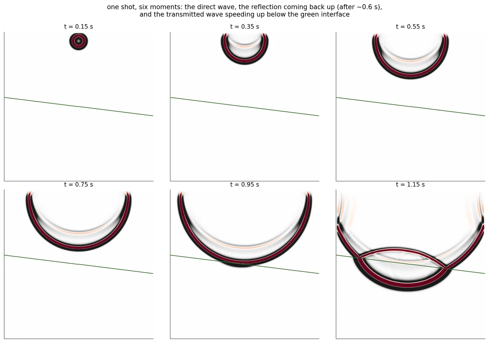
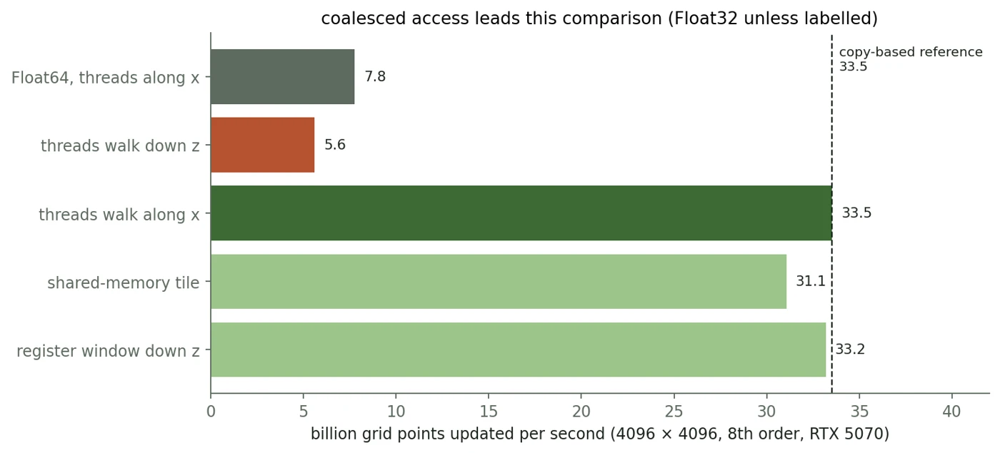

# Seismic imaging in Julia

Seismic wave simulation and reverse-time migration in Julia and CUDA.jl.

A sound pulse travels through a 2D model with two rock layers. At the boundary,
part of the wave reflects back toward the surface; the rest continues into the
lower layer. We record those echoes and use reverse-time migration to estimate
where the boundary is.



One shot at six times. The green line marks the layer boundary. Each panel uses
its own pressure scale.

[Seeing underground with sound](https://aalquwayfili.com/writing/seismic-imaging-from-zero/)
walks through the physics, the code, and the recorded RTX 5070 benchmarks.

## Run

Julia 1.12 or later and an NVIDIA GPU supported by CUDA.jl are required for the
simulations. Plotting and the CPU tests work without a GPU.

```sh
julia --project=. -e 'using Pkg; Pkg.instantiate()'
julia --project=. scripts/wave2d.jl demo n=512 out=out
julia --project=. -t auto scripts/rtm.jl n=512 shots=8 out=out
julia --project=. scripts/plot.jl out
```

The output directory contains Float32 arrays in Julia's column-major order,
metadata, and PNG plots. Demo output is stored as Float32 even when the simulation
uses Float64. The RTM plot shows both the raw image and a Laplacian-filtered image,
with contrast adjusted separately for each panel.

For a headless machine, set `GKSwstype=100` when running the plotting script.

## Benchmarks

```sh
julia --project=. scripts/wave2d.jl bench n=4096 steps=300 all=1
julia --project=. scripts/wave2d.jl bench n=4096 steps=300 T=Float64 kernel=rows
```

There are four kernels: `cols` uses strided reads, `rows` uses coalesced reads,
`tile` stages a block in shared memory, and `reg` keeps a sliding window in
registers. Each benchmark warms up for 20 steps before timing the update loop.

`GPts/s` counts interior grid points updated per second. `GB/s` estimates traffic
as three arrays read and one written per update. It assumes cached neighbour
reads and excludes the damping arrays. `%copy` compares this estimate with a
separate memory-copy test; it is not a measurement of DRAM utilisation.



Recorded results from the article: RTX 5070, 4096 × 4096 grid, 300 timed steps.
These are earlier measurements from the RTX 5070. A fresh run on that PC is pending.

On 22 September 2026, the current solver passed all 12 GPU checks on two
Quadro RTX 8000s. Single-device results on GPU 0, using the same grid and step
count, were:

| Kernel | Precision | Median GPts/s (3 runs) |
| --- | --- | ---: |
| Strided | Float32 | 3.37 |
| Coalesced | Float32 | 35.90 |
| Shared-memory tile | Float32 | 29.78 |
| Register window | Float32 | 33.43 |
| Coalesced | Float64 | 8.31 |

[Raw results, source commit and environment](docs/benchmarks/2026-09-22-quadro-rtx-8000.txt).
These establish a workstation baseline. The older RTX 5070 results used different
code and Windows, so they are not a controlled comparison.

To validate a machine and record three runs of each benchmark:

```sh
julia --project=. scripts/validate.jl
```

Run this after installing dependencies, with the benchmark GPU idle. Results go
to a dated directory under `out/`, alongside the commit, dependency versions,
hardware details and GPU test output. Benchmarks use device 0; the tests also
check transfers between two devices when available. Use the same commit on each
machine for a comparison.

## Two devices

```sh
julia --project=. scripts/two_gpu.jl n=512 steps=200 devices=0,0 check=1
julia --project=. scripts/two_gpu.jl n=4096 steps=200 devices=0,1 check=1
julia --project=. scripts/two_gpu.jl n=4096 steps=200 devices=0,1 overlap=1 check=1
```

The grid splits along depth, with four halo rows exchanged each step. `check=1`
compares the result with a single-device run and fails if they disagree.
`devices=0,0` checks the split on one physical GPU.

The split-grid checks pass on two physical Quadro RTX 8000s at 128 × 128, with
and without transfer overlap. Both match the single-device result in the test.
GPU 1 had other jobs running, so clean two-GPU scaling measurements are still
pending. The test output is included in the raw results above.

## Tests

```sh
julia --project=. test/runtests.jl
julia --project=. test/plots.jl
julia --project=. test/gpu.jl
```

The CPU checks cover the stencil, model helpers, arguments, and file format.
Plot tests use synthetic arrays. GPU tests compare all four kernels with a CPU
reference on a grid that does not fit whole thread blocks, compare RTM storage
modes, and check the split grid. The GPU test command fails if CUDA is unavailable;
it checks two physical devices when both are present.

## Layout

```text
src/          Numerical helpers, wave kernels, migration and grid splitting
scripts/      Commands for demos, benchmarks, experiments and plotting
test/         CPU, plotting and CUDA checks
docs/         README figures and recorded benchmark results
```

Run the commands from the repository root. The scripts write to `out/` or `figs/`;
those generated files stay out of git.

To regenerate the simulation figures:

```sh
julia --project=. -t auto scripts/figures.jl
julia --project=. scripts/plot.jl figs
```

These commands generate new simulation output. The article's explanatory diagrams
and historical timing chart are not generated by this script.

## Model and references

The solver uses a constant-density acoustic equation, an eighth-order spatial
stencil, second-order time stepping, a Ricker source, and a damping border.
Migration uses a smoothed copy of the known synthetic velocity model and subtracts
its recordings to reduce the direct wave. Boundary reconstruction is evaluated
inside the undamped region.

- [Igel: finite-difference acoustic modelling](https://krischer.github.io/seismo_live_build/html/Computational%20Seismology/The%20Finite-Difference%20Method/fd_ac2d_homogeneous_solution.html)
- [Micikevicius: finite differences on GPUs](https://developer.download.nvidia.com/CUDA/CUDA_Zone/papers/gpu_3dfd_rev.pdf)
- [Devito: reverse-time migration](https://www.devitoproject.org/examples/seismic/tutorials/02_rtm.html)
- [Boundary-saving methods](https://academic.oup.com/jge/article/10/1/015004/5110253)
- [CUDA.jl: multiple devices](https://cuda.juliagpu.org/stable/usage/multigpu/)
